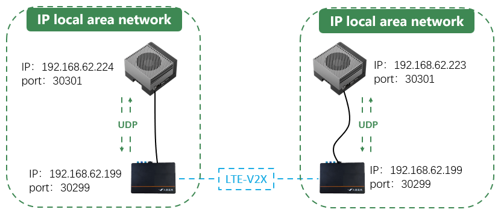
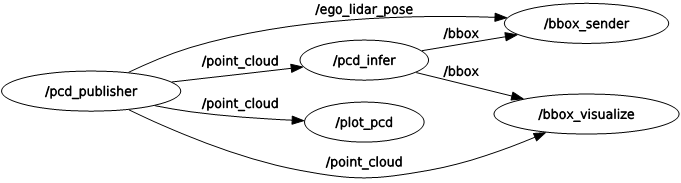
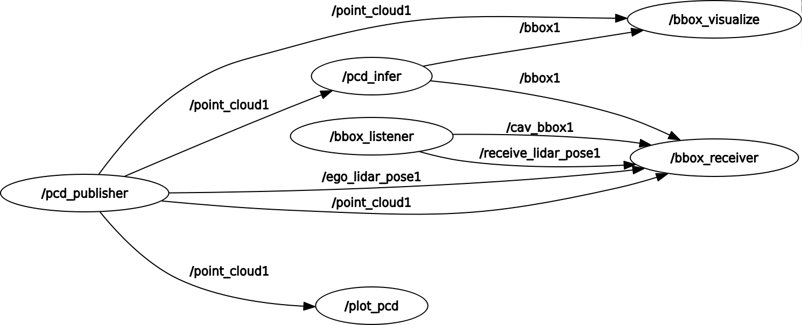

# V2X_cooperative_perception_system

This is a V2X Cooperative Perception Demo Platform developed based on NVIDIA Jetson AGX Orin and the Datang In-Vehicle On-Board Unit (OBU) platform.

## Network topology of connected devices
The device IP and port configurations are as shown in the figure below. The left side represents the sender, and the right side represents the receiver. For information on how to run the devices, please refer to [[how_to_run]](./document/how_to_run.md).

## ROS2 graph 
- sender

- receiver

## Reference
- [ROS2 node for TAO-PointPillars](https://github.com/NVIDIA-AI-IOT/ros2_tao_pointpillars)
- [ROS 2 Documentation: Foxy](https://docs.ros.org/en/foxy/index.html)
- [NVIDIA TAO](https://docs.nvidia.com/tao/tao-toolkit/text/point_cloud/pointpillars.html#creating-an-experiment-spec-file)

## Demo
<!-- mp4格式 -->
<video id="video" controls="" preload="none" poster="封面">
      <source id="mp4" src="./video/CP_output_file.mp4" type="video/mp4">
</videos>
