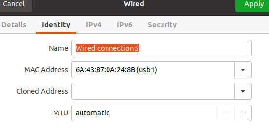
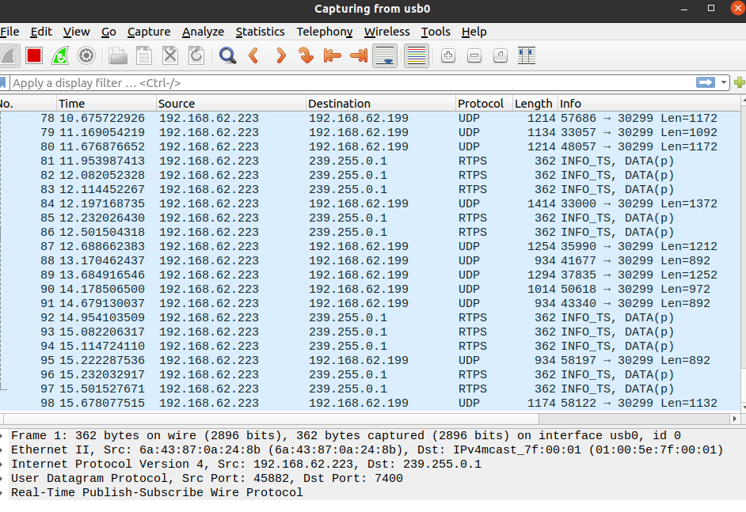
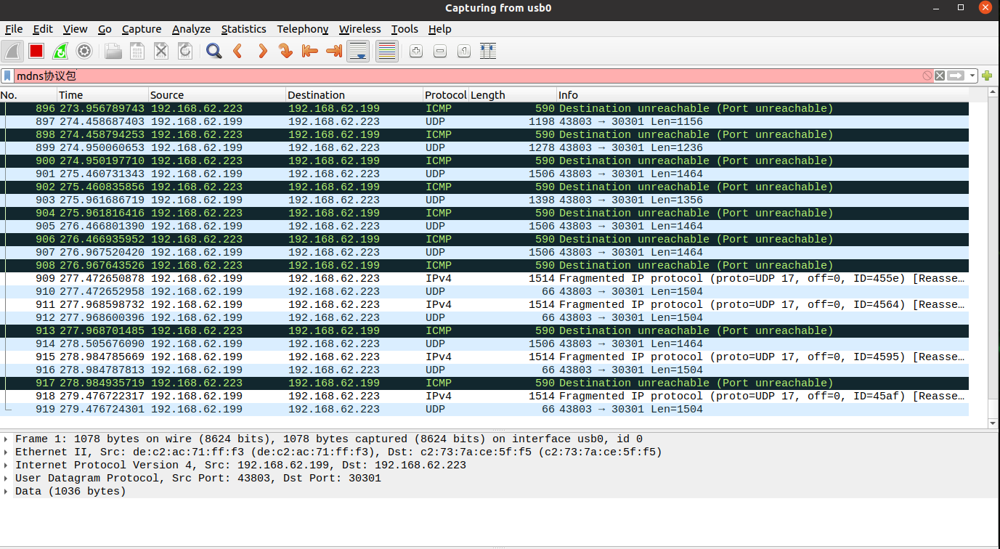

# 操作指南
## 硬件连接
- 注意事项1：由于OBU中设置上位机发送到下位机选择的“usb0”,OBU连接后需要注意一下连接的网卡口为“usb0”，如果是“usb1”的话，可能需要重启！

- 注意事项2:目前两台OBU的UDP接收配置为（可以通过AT指令查询），
--设备编号：22019446：0,192.168.62.224:30301
--设备编号：21029792：0,192.168.62.223:30301 
目前两台OBU的UDP发送配置为（可以通过AT指令查询）：2,usb0:30299 （2代表采用TLV模式）
- 注意事项3：协同感知发送端设备为：OBU编号：22019446，Orin编号：22017658；协同感知接收端设备为：OBU编号：21029792，Orin编号：22017657
- 注意事项4：如果要进行V2V通信，两个OBU的GNSS灯必须蓝闪，不然无法通信！
## 实验流程
### 发送端
进入到工作区的目录下`ros2_workspace`，source安装文件
```
. install/setup.bash
```
如果对其中的代码进行了更改，就需要重新封装为ROS2的包
```
colcon build --packages-select point_cloud_infer
```
ROS2节点的代码都在`ros2_workspace/src/point_cloud_infer/point_cloud_infer`中，需要启动哪些节点的启动文件在`ros2_workspace/src/point_cloud_infer`中，发送端的启动文件为`bounding_box_client_launch.py`
发送端的ROS-Graph图如下：

这个图能够帮助看懂发送端节点之间的关系和订阅的消息，更好理解代码。
接下来可以启动发送端节点：
运行launch文件
```
ros2 launch point_cloud_infer bounding_box_client_launch.py pcd_path:=/home/thu/Downloads/2021_08_23_21_47_19/243 engine_path:=/home/thu/Downloads/PointPillarNet/checkpoint_epoch_80_fp32_v2.engine rate:=2
```
此时可以运行抓包软件Wireshark，选择usb0端口，可以看到上位机的ip地址(192.168.62.223)在向下位机OBU地址(192.168.62.199)通信：


###接收端
同样进入到工作区目录下`ros2_workspace`，source安装文件
```
. install/setup.bash
```
如果对其中的代码进行了更改，就需要重新封装为ROS2的包
```
colcon build --packages-select point_cloud_infer
```
ROS2节点的代码都在`ros2_workspace/src/point_cloud_infer/point_cloud_infer`中，需要启动哪些节点的启动文件在`ros2_workspace/src/point_cloud_infer`中，接收端的启动文件为`bounding_box_server_launch.py`
接收端的ROS-Graph图如下：

这个图能够帮助看懂接收端节点之间的关系和订阅的消息，更好理解代码。
接下来可以启动接收端节点：
运行launch文件
```
ros2 launch point_cloud_infer bounding_box_server_launch.py pcd_path:=/home/thu/Downloads/2021_08_23_21_47_19/255 engine_path:=/home/thu/Downloads/PointPillarNet/checkpoint_epoch_80_fp32_v2.engine rate:=2
```
- 注意事项：为了模拟实际情况的协同感知，发送端和接收端最好一起启动launch文件，尽量保证场景的时空对齐，同时一定注意两台OBU的GNSS蓝闪，如果均蓝闪，但接收端的wireshark没有抓到包，可能需要重启一下Orin（目前尚不清楚原因）。
接收端运行抓包软件Wireshark，选择usb0端口，可以看到下位机OBU地址(192.168.62.199)在向上位机的ip地址(192.168.62.223)通信：



